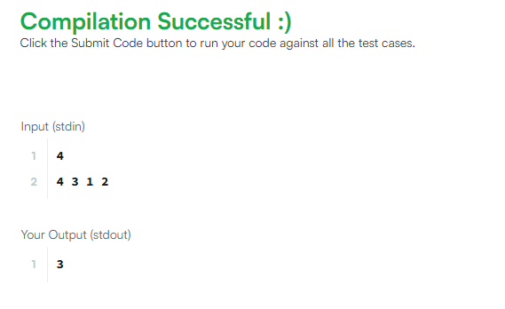
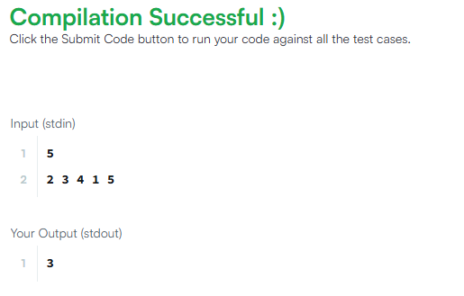
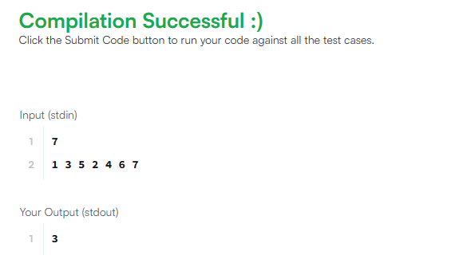
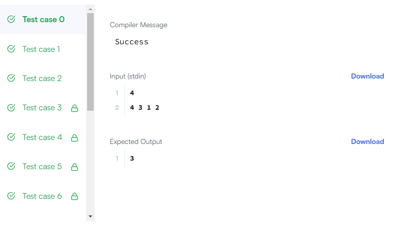
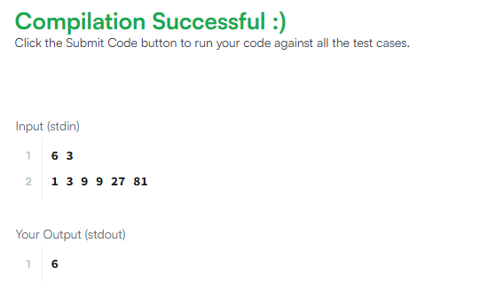
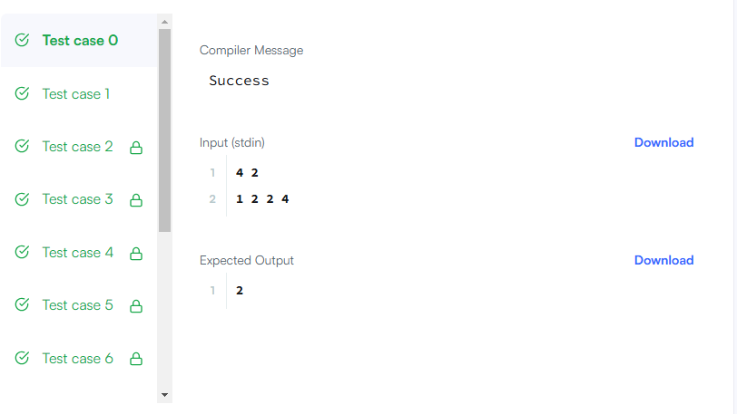

# Prueba de Selección - Traund

Este repositorio contiene las soluciones para las pruebas técnicas solicitadas por Traund a través de HackerRank. Las pruebas incluyen:

1. **Minimum Swaps 2**: [Enlace a la prueba](https://www.hackerrank.com/challenges/minimum-swaps-2/problem?h_l=interview&playlist_slugs[]=interview-preparation-kit&playlist_slugs[]=arrays)
2. **Count Triplets**: [Enlace a la prueba](https://www.hackerrank.com/challenges/count-triplets-1/problem?h_l=interview&playlist_slugs[]=interview-preparation-kit&playlist_slugs[]=dictionaries-hashmaps)

## Explicación de los archivos

### `prueba-01.js`

Este archivo contiene la solución para el problema **Minimum Swaps 2**. La función principal `minimumSwaps` calcula el número mínimo de intercambios necesarios para ordenar un arreglo. La lógica se basa en identificar ciclos en el arreglo y contar los intercambios necesarios para ordenar cada ciclo.

- **`readLine`**: Función que lee la siguiente línea de la entrada.
- **`minimumSwaps`**: Función que calcula el número mínimo de intercambios necesarios para ordenar un arreglo.
- **`main`**: Función principal que procesa la entrada y genera la salida.

#### `Test`

#### `Envio`

### `prueba-02.js`

Este archivo contiene la solución para el problema **Count Triplets**. La función principal `countTriplets` cuenta las tripletas que forman una progresión geométrica con una razón `r`. La lógica se basa en utilizar objetos para contar la cantidad de veces que aparece cada número en el arreglo y la cantidad de pares válidos.

- **`readLine`**: Función que lee la siguiente línea de la entrada.
- **`countTriplets`**: Función que cuenta las tripletas que forman una progresión geométrica con razón `r`.
- **`main`**: Función principal que lee la entrada, llama a `countTriplets` y escribe la salida.

#### `Test`

#### `Envio`

## Resultados de los tests

Las soluciones fueron probadas en HackerRank y se obtuvieron los siguientes resultados:

- **Minimum Swaps 2**: Todos los tests pasaron correctamente.
- **Count Triplets**: Todos los tests pasaron correctamente.
